### Что из себя представляет StyleGAN?

GAN или же генеративно-состязательная сеть - специальный комплекс из двух нейронных сетей: генератора и дискриминатора. Нейросеть-генератор получает на вход шум и пытается преобразовать его во что-то осмысленное. Нейросеть-дискриминатор оценивает результаты работы генератора и, если те слишком сильно отличаются от ожидаемых, ругает генератор за это. Схема с дискриминатором тут оказывается весьма кстати, потому что самому оценивать все возможные результаты работы генератора весьма трудозатратно.

Style исходит из техники "style transfer", которую раньше применяли для переноса стиля с одних изображений на другие. Разработчикам StyleGAN показалось, что это будет хорошей идеей - попытаться той же техникой переносить стиль на случайный шум и тем самым генерировать изображения с нуля.

Генератор в StyleGAN работает по свёрточной модели: в нейронной сети генератора находятся несколько слоёв, каждый из которых больше предыдущего (то есть, первый 4х4, второй 8х8, третий 16х16 и так далее до желаемого разрешения картинки) и каждый из которых последовательно за предыдущим уточняет изображение, подкрашивая его и добавляя в него новые детали. К примеру, первый слой задаёт фон и цвет центрального объекта, второй уточняет цвета и добавляет основу для деталей, третий дорисовывает детали, а четвёртый добавляет чёткости и узоров.

StyleGAN в отличии от обычной реализации GAN для изображений добавляет "артистичный" шум на каждом вычислительном слое, а не только на входе самого первого слоя. Таким образом, у него лучше и чётче получаются мелкие детали, которые должны дорисовываться на последних слоях генератора.

Ссылка на оригинальную статью - https://dtf.ru/u/48338-akkaunt-ne-ispolzuetsya/911302-pogruzhaemsya-v-stylegan

---

### Версии 

На данный момент существует уже четыре реализации StyleGAN: [StyleGAN1](https://github.com/NVlabs/stylegan), [StyleGAN2](https://github.com/NVlabs/stylegan2), [StyleGAN2-ADA](https://github.com/NVlabs/stylegan2-ada) и [StyleGAN3](https://github.com/NVlabs/stylegan3). Каждая из них является логичным продолжением предыдущей, решая определённые проблемы в генерациях, но в целом они все работают по одной вышеописанной системе. У версии 1 существует официальная реализация исключительно на TensorFlow, у версии 2 на Pytorch и на TensorFlow, а у версии 3 только на Pytorch *если я не ошибаюсь*.

Изначально для использования [DatasetGAN](https://nv-tlabs.github.io/datasetGAN/) я пытался реализовать проект на StyleGAN1, т.к. именно его модель в дальнейшем используется для создания разметки, но столкнулся с рядом трудностей. Последние наработки реализованы уже на StyleGAN3, что решает множество проблем совместимости, но делает невозможным использование DatasetGAN. 

Важный момент. Ни для одной из версий в качестве входных данных разметка не нужна.

---

### StyleGAN1

Первый SG был написан в 2018 году, что влечет за собой некоторые проблемы совместимостей. Самая большая проблема заключается в том, что в реализации используются старые версии большинства библиотек, в числе которых и основная - TensorFlow, который не имеет обратной совместимости современных версий 2.x до необходимых 1.13-1.15. Я использовал версию tensorflow-gpu==1.15.2 (в данном случае -gpu является обязательным, т.к. версии младше 2.x не умеют по умолчанию работать с CUDA). Далее требуется подходящее окружение в виде CUDA 10.0 и cuDNN 7.4 (но, как выяснилось, можно и 7.6). Вот официальная таблица совместимостей версий - https://www.tensorflow.org/install/source#gpu. Вот ссылка на докер с нужными ресурсами - https://github.com/Desklop/docker_image_with_cuda10_cudnn7. 

Из этого вытекает основная проблема, что видеокарты 30-го поколения работают с версиями CUDA старше 11.1, что, по идее, делает невозможным обучение на этой серии видеокарт. Вероятно, проблема решаема (судя по [этой](https://www.reddit.com/r/MachineLearning/comments/mfzm9h/d_rtx_3080_cuda_100/) статье), но, скорее всего, проблемы совместимостей на этом не заканчиваются.

Для обучения необходимо в первую очередь подготовить датасет. Необходим набор фото (максимальное разрешение 1024х1024 из-за особенностей работы GAN). Далее с помощью скрипта, который есть в репозитории SG dataset_tool.py датасет переводится в нужный формат. Скрипт вызывается через консоль, передается папка с исходными (уже ресайзнутыми) изображениями, и скрипт сам переводит все изображения в необходимый для SG формат. 
 
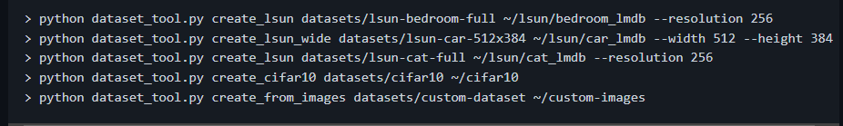  
В данном случае нас интересует последняя строчка, а именно функция create_from_images. Первый параметр - путь на выход, второй параметр - путь на вход. После завершения работы скрипта в указанной папке появятся несколько файлов с разрешением .tfrecords.

!!! Внимание !!! Итоговые данные будут весить примерно в 19 раз больше, т.к. каждое фото будет храниться в 10 (или менее) разных разрешениях (зависит от итогового разрешения, для 1024 - это 10, для 512 - это 9 и т.д. по аналогии).

Далее меняется несколько строчек в скрипте train.py, а именно:  
- Выставляется нужно кол-во GPU   
    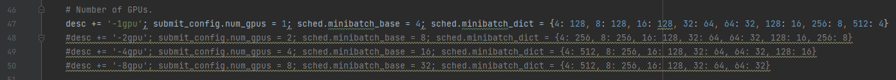  
    (нужная строка просто раскомментируется)
    
    
- Уточняется название датасета и разрешение.  
    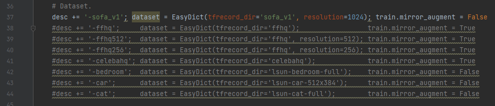  
    Mirror_augment отвечает за обучение, в том числе на зеркально отраженных фото, занимает больше времени соответственно. 
    По умолчанию программа будет искать указанный датасет в папке datasets.
    
    
- Выставляется нужный kimg.  
    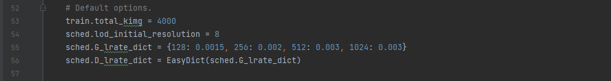  
    Kimg является чем то вроде количества итераций обучения. При достижении указанного значения обучение закончится. Выбор kimg - это довольно важный момент, т.к. для максимального качества полученных изображений советуют 25к, но хорошие результаты можно получить и на 5-10к. Поэтому простого ответа на вопрос, сколько нужно ставить, нет.
    
    
- Существуют еще некоторые настройки, которые, при необходимости, можно посмотреть в репозитории, но первостепенно они не так важны. 

Далее представлена таблица из репозитория SG. Она не полная и многих данных тут не хватает, но можно сделать предположение, что данные указаны для 25k kimg. 
 
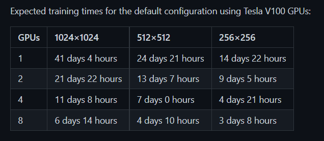   

Здесь указано примерное время полного обучения в зависимости от имеющихся ресурсов. Вычисления, естественно, приблизительные. Важный момент в том, что при изменении kimg, время тоже будет пропорционально меняться.

!!! Внимание !!! Для обучения понадобятся видеокарты с 11 гб видеопамяти минимум.

Если все параметры настроены верно, то можно приступать к обучению. Для начала обучения достаточно просто вызвать скрипт train.py через консоль. 
 
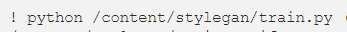  

Если все сделано правильно, то в консоли начнут появляться логи:
 
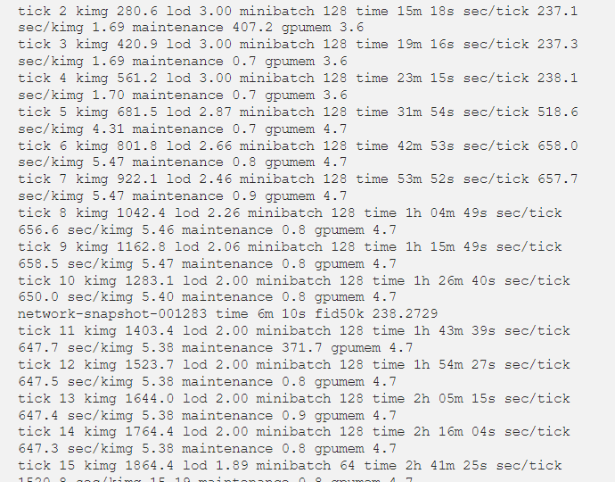  

В репозитории первой версии указано не так много информации, но основную часть я брал оттуда.

P.S. За примерно 2 недели я дошел до момента запуска, но в итоге уперся в очередные несоответствия каких-то библиотек.

2 хорошие статьи по теме: 
https://www.gwern.net/Faces#data  
https://medium.com/analytics-vidhya/training-stylegan-using-transfer-learning-on-a-custom-dataset-in-google-colaboratory-bf4f1da95df1

---

### StyleGAN3

Третья версия SG написана уже на новых версиях библиотек, а также существует официальная реализация на Pytorch, что тоже упрощает использование. Также в репозитории уже находится готовый [докер](https://github.com/NVlabs/stylegan3/blob/main/Dockerfile) со всеми необходимыми библиотеками и другим.

К входным данным третья версия тоже менее привередлива. На вход подойдет просто папка с готовым датасетом (1024х1024 или меньше), но лучше ее прогнать через dataset_tool.py. В 3 версии он работает по-другому, и на выходе можно получить zip архив или также папку с изображениями. 
 
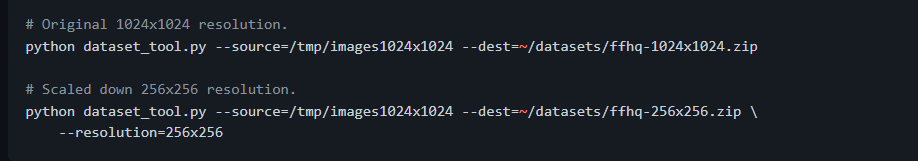  
В данном случае --source = путь к исходной папке или zip с изображениями, а --dest = путь к итоговой папке или zip с изображениями. Складывать итоговый датасет лучше в папку datasets. Хранение в виде zip ускоряет загрузку данных в сам SG. 

В отличие от первой версии, настройка параметров обучения осуществляется непосредственно при вызове train.py и все нужные параметры передаются как аргументы. Также кол-во этих настроек сильно возросло по сравнению с первой версией, и некоторые из них, возможно, придется подбирать практическим методом для достижения необходимого результата по времени или качеству. 
Пример вызова:  
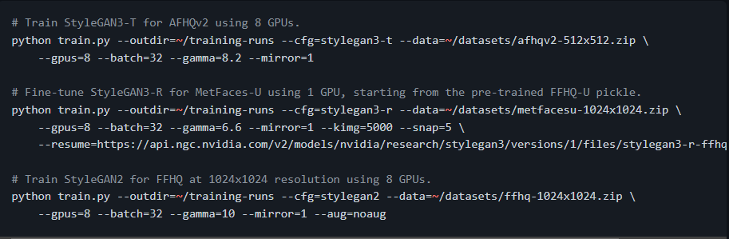  

Попробую пройтись по основным параметрам, остальные можно посмотреть в [репозитории](https://github.com/NVlabs/stylegan3/blob/main/docs/configs.md). В отличие от первой версии, он дает исчерпывающий объем нужной информации. 
- outdir - папка, куда будут сохраняться результаты обучения и чекпоинты (советую не менять)
- сfg - возможен в 2 вариантах - это -t и -r. Различия заключаются в том, что -r использует также повернутые изображения, что занимает больше времени.
- data - путь к датасету, на котором планируется обучение модели
- gpus - кол-во доступных gpu
- batch - общий объем используемой видеопамяти 
- gamma - довольно сложный параметр, его советуют подбирать
- mirror - нужно ли обучать на зеркальных изображениях
- kimg - уже знакомое нам количество итераций
- snap - периодичность сохранение чекопинтов (далее подробнее)

Также, возможно, параметр --metrics=none сильно ускорит обучение, т.к. в моем случае каждые 1.25 часа обучения, программа считала метрику 40 минут.

Если время позволяет, советую прочитать [оригинальную статью](https://github.com/NVlabs/stylegan3/blob/main/docs/configs.md) в репозитории.

В 3 версии SG представлены более подробные данные о времени обучения. Вот примерные расчеты для разрешения 1024.
 
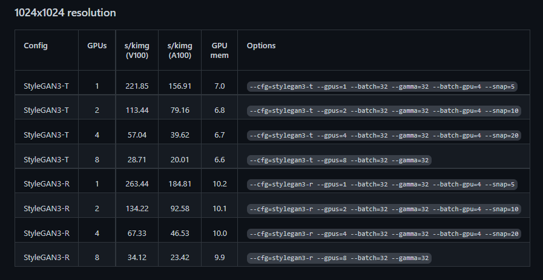  
Умножив s/kimg на kimg, указаный выше, можно получить примерное время обучения, если не учитывать метрику. Более подробные данные есть в той же статье.

!!! Внимание !!! Для использования этой версии SG понадобится видеокарты с уже минимум 16 гб видеопамяти.

Если все параметры указаны верно и все библиотеки установлены правильно, через некоторое время должно начаться обучение. В консоли начнут появляться логи.
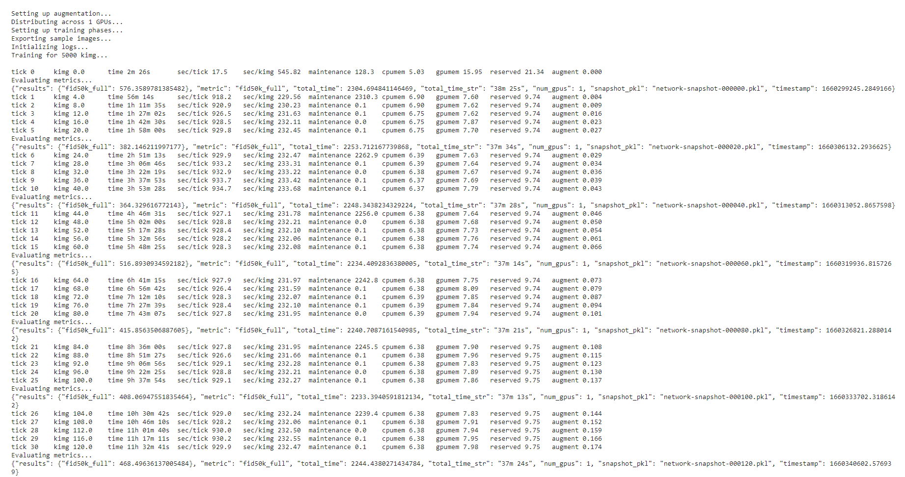  

Результаты обучения будут сохраняться в новую папку results. Каждые snap итераций будет сохраняться чекпоинт модели и фото того, что на данный момент может генерировать сеть.  
 
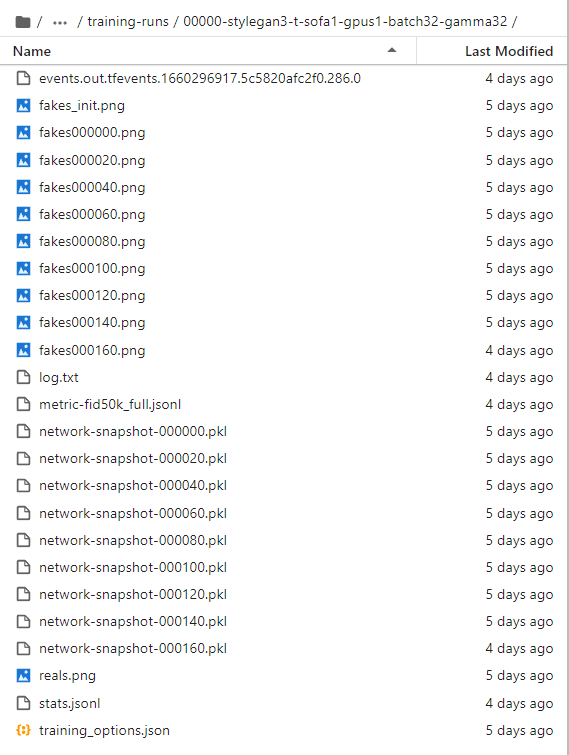  
Модель будет сохраняться в виде pkl файла. 

Обучение можно приостановить при необходимости, а далее продолжить с последнего pkl файла. Настройки для корректного продолжения обучения также указаны в репозитории.

В SG3 существует большое множество фишек и особенностей, которые можно изучить. Пока что я разобрал только основной скелет программы, который достаточно знать для базового использования. 

Обучение SG3 у меня получилось корректно запустить с первого раза. Длилось оно примерно 12 часов на не самых, по-видимому, оптимальных настройках. 

    !python3 /workspace/stylegan3/train.py --outdir=/workspace/stylegan3/training-runs --cfg=stylegan3-t data=/workspace/stylegan3/datasets/sofa1.2 --gpus=1 --batch=32 --gamma=32 --batch-gpu=4 --mirror=0 --kimg=5000 --snap=5

Прикладываю [ссылку](https://disk.yandex.ru/d/2zdp3ljiOR6tEA) на мою модель после 160 kimg из 5000, а также финальное фото.  
  

Невозможно гарантировать качественный результат, так как генерация изображений в данном случае больше искусство чем наука. Для точной настройки и улучшения качества итоговых изображений, возможно, придется методом проб и ошибок перебрать все имеющиеся параметры. И не факт, что будет достигнут удовлетворительный результат потому, что StyleGAN лучше всего работает на простых объектах вроде лиц, птиц и т.д.

На этом все. Автор: [Телеграм](https://t.me/tcarroflan)